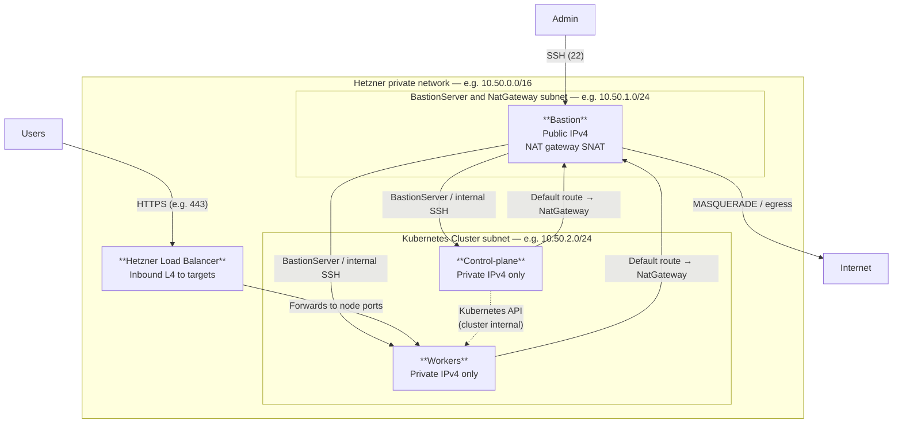

# Infrastructure - Challenge

This repository aims to deploy the infrastructure for a Kubernetes cluster using Terraform, Ansible and GitOps.

All the code developed here was done with the support of [Cursor](https://cursor.com/)

## Scope and assumptions

- Target environment: Virtual Machines on Hetzner.
- Kubernetes distribution: **kudeadm v1.35**.
- GitOps tool: **Flux CD v2** (GitRepository + HelmRelease + Kustomization).
- Stateful operator: CloudNativePG.
- Backup target: S3-compatible object storage (MinIO or AWS S3).


## Security-by-default decisions

- Least-privilege RBAC for app/service accounts.
- Namespace isolation and default deny network policies.
- Secret references externalized (SOPS/ExternalSecrets-ready).
- Hardened node baseline via Ansible (SSH, firewall, fail2ban).

## Planning

### Project Delivery Plan

#### 21.03.2026 - Planning
- [X] Planning
  - [X] Tasks Breakdown
  - [X] Date of the Deliverables

#### 21.03.2026 - Infrastructure Code
- [X] Infrastructure Code
  - [X] Terraform Code to deploy servers on Hetzner
  - [X] Ansible Code to deploy Kubernetes on the servers
  - [X] Ansible Code to deploy FluxCD on the cluster

#### 22.03.2026 - GitOps Code and Workflow
- [X] GitOps Code and Workflow
  - [X] Create manifests for required operators
    - [X] CloudNativePG
  - [X] Configure CloudNativePG
    - [X] 3 PostgreSQL instances
    - [X] Persistent volumes
    - [X] Failover configuration
  - [ ] Configure Automated Backups

#### 22.03.2026 - Monitoring Setup
- [X] Monitoring Setup
  - [X] Create manifests for required operators
    - [X] Service Monitor
    - [X] Exporters

#### 27.03.2026 - Work on Upgrades
- [ ] Work on Upgrades
  - [ ] PostgreSQL Upgrade
  - [X] GitOps Change Management

#### 28.03.2026 - Deploy Applications
- [ ] Deploy Applications
  - [ ] Deploy applications on the infrastructure

#### 28.03.2026 - Update Documentation
- [ ] Update Documentation
  - [ ] Update documentation according to all changes


## Team Structure
| Role | Responsibilities | 
|------|------------------|
| Lead DevOps | Architecture, decisions, escalation, Infrastructure Automation, Team Planning and Costs Supervision|
| DevOps Engineer | CI/CD, infrastructure, automation and Backup/Restore |
| DevOps Engineer | CI/CD, infrastructure, automation and Security Focus |
| SRE Engineer | Monitoring, reliability, security, Incident Response Owner |


---

## Review Process

For the developemnt process we have to follow the [GitFlow](https://www.atlassian.com/git/tutorials/comparing-workflows/gitflow-workflow)

**Main branch needs always to be protected**

A Merge Request template needs to be created in order to establish the minium review criterias:

Eg.

* No code duplication
* No secrets in the code
* Code needs to be properly formatted, terraform for example, you should always run **terraform fmt** before commiting
* Always follow the best practices [Terraform Best Practices](https://developer.hashicorp.com/terraform/cloud-docs/recommended-practices)


### Code Reviews
- [ ] All changes via Merge Requests
- [ ] Minimum reviewers: 1
- [ ] Automated checks (lint, tests, security scans):
- [ ] Use AI for automated checks, Reviews and Suggestions [Vibe and Verify example](https://www.sonarsource.com/sem/vibe-then-verify)


## Release Management
### Release Strategy

Every code that is merged to the main branch needs to have a tag the follows the [Linux Versioning](https://www.kernel.org/doc/html/v4.11/process/2.Process.html) standard.

  
    major-version.minor-version.patch

eg.

    v10.5.2

In the case of terraform modules for example, the version needs to be pinned liked this:

```
module "vpc" {
  source = "git::ssh://git@github.com/org/infra-modules.git//modules/vpc?ref=v1.2.0"
}
```

So we can make new releases without breaking the existing code.


## Multi-Environment Deployments

### Customer-Specific Configurations

#### Strategy

For Kubernetes workloads we can do all the configurations using [GitOps](https://www.gitops.tech/#what-is-gitops)

```
gitops/
  clusters/
    customer1/
      dev/
      prod/
    customer2/
      dev/
      prod/
```

Then all the management can be centralized, or case the customer needs to have access to the configuration, FluxCD allows to have the configuration in a separated repository: [Ways of structuring your repositories](https://fluxcd.io/flux/guides/repository-structure/)


#### Secrets Separation

All the secrets can be separated using an external secret management solution, like [OpenBao](https://openbao.org)

Each customer could have their own namespaces.

Docs about [OpenBao Namespaces](https://openbao.org/docs/concepts/namespaces/)

The secrets can be dynamically synced into the applications using the [External Secrets Operator](https://external-secrets.io/latest/)


## Repository structure

- `terraform/`: modular provisioning (`network`, `compute`, `nat-gateway`, `loadbalancer`, `kubernetes`, …) and `dev` / `prod` environments.
- `ansible/`: idempotent roles to configure hosts and bootstrap Kubernetes with kubeadm and install FluxCD Operator.
- `gitops/`: Flux manifests and workload kustomize trees separated by cluster and concern (see `gitops/README.md`).
- `demo-app/`: containerized REST API that reads/writes PostgreSQL data.
- `docs/`: architecture, operations and security.

## Hetzner infrastructure architecture

Terraform `kubernetes` module (see `terraform/environments/dev/`): one VPC, **two subnets**, **BastionServer** with public IPv4 and **SNAT** for the cluster subnet, **private-only** control-plane and workers, a **workers load balancer** by default for inbound app traffic, and an **optional** second LB for the **Kubernetes API** (control-plane).

To protect all the nodes, none of it have a public IP Address, then to access it, it is necessary to use the BastionServer. I used to have the same configuration in the past, but i provided the cluster using [KOPS](https://kops.sigs.k8s.io)

Hetzner does not have a NatGateway Service, like we have on AWS, then i had to provide one and make the configuration via Cloud-Init, so the nodes can access the internet and download the packages.

In order to secure the Kubernetes Cluster, all the nodes are private and the applications are exposed via Hetzner LoadBalancer.



| Path | Description |
|------|-------------|
| **Admin → cluster** | SSH only to **jump** from the Internet; Ansible uses **BastionServer** to reach master/worker private IPs. |
| **Cluster → Internet** | `apt`, image pulls, etc.: **default route via BastionServer**; BastionServer applies **SNAT** for the cluster subnet. |
| **LB** | **Inbound** only (no outbound NAT). **Workers LB** is on by default (`lb_services`: **80→30080**, **443→30443**). **API LB** is optional (`expose_kubernetes_api_via_load_balancer` → master **6443**). |
| **Firewalls** | Separate rules for **BastionServer** vs **Kubernetes** nodes (SSH to nodes restricted to jump subnet + optional extra CIDRs). |

## Quick start

### 1) Provision infrastructure (Terraform)

```bash
cd terraform/environments/dev
terraform init
terraform plan -out tf.plan
terraform apply tf.plan
```

### 2) Configure nodes and bootstrap Kubernetes (Ansible kubeadm)

Hetzner layout uses a **bastion / jump** host (public IP), **private control-plane and workers**, and **ProxyJump** for Ansible. See `terraform/environments/dev/README.md`.

```bash
cd ansible
ansible-galaxy collection install -r requirements.yml
# Edit inventory: set jump public IP and [bastion] group — see inventory/dev-test-cluster.ini
ansible-playbook -i inventory/dev-test-cluster.ini playbooks/bootstrap-k8s.yml
```

## Ansible usage (role, playbook, inventory)

- **Inventory**: `ansible/inventory/dev-test-cluster.ini` (example)
  - `[bastion]`: jump host (Terraform output public IPv4)
  - `[kubeadm_control_plane]` / `[kubeadm_workers]`: private IPs on **cluster subnet** (`10.50.2.x`), `ProxyJump` via jump
- **Roles**: `base`, `security`, `kubernetes` (kubeadm install/init/join/CNI)
- **Playbook**: `ansible/playbooks/bootstrap-k8s.yml`
  1. Harden **bastion** (`base`, `security` — keeps NAT after UFW)
  2. Prepare cluster nodes (`base`, `security`, `kubernetes` install)
  3. `kubeadm init` / join / Calico (Tigera operator)

### Runbook

1. SSH to the **jump** host (public IP from Terraform).
2. Fill in `inventory/dev-test-cluster.ini` (`REPLACE_JUMP_PUBLIC_IP`, `[bastion]`).
3. Run the playbook as above.

### Optional validation after deployment

Run from the control plane:

```bash
kubectl get nodes -o wide
kubectl get pods -A
```

### 3) Install Flux CD and sync GitOps

Install Flux on the cluster (see `ansible/README.md`), then bootstrap against this repository so the sync path matches **`gitops/clusters/<env>`**, for example:

```bash
export GITHUB_TOKEN=ghp_...   # PAT with permissions required by Flux + your repo
flux bootstrap github \
  --owner=<org-or-user> \
  --repository=<this-repo> \
  --branch=main \
  --path=./gitops/clusters/dev \
  --personal   # omit for GitHub org-owned repo
```

Or use Ansible: `ansible/playbooks/install-fluxcd.yml` with **`fluxcd_github_bootstrap=true`** and **`fluxcd_github_path=gitops/clusters/dev`**.

Flux then reconciles (via `HelmRelease` + Flux `Kustomization` CRs committed under that path):

- CloudNativePG operator (Helm) and Postgres cluster manifests
- Demo application
- Monitoring/backup resources in the kustomize trees

## Lifecycle management

- **Monitoring**: `PodMonitor`/`ServiceMonitor` compatible labels for Prometheus stack.
- **Backup**: scheduled `CloudNativePG` backups to object storage.
- **Restore**: documented restore flow in `docs/operations.md`.