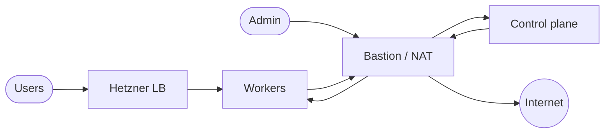

# Architecture

## Hetzner (Terraform)

- **VPC:** bastion/jump + NAT subnet (public SSH, SNAT); private cluster subnet (control-plane + workers).
- **Egress:** private nodes route via VPC; **MASQUERADE** on bastion (no managed NAT product).
- **LB:** workers LB → ingress NodePorts (e.g. **80→30080**, **443→30443**). Optional API LB → **6443**.

**Paths:** Admin SSH → bastion → nodes. Users → LB → workers. Cluster → Internet via NAT host.

### Overview

## Kubernetes

- **Bootstrap:** Ansible **kubeadm** + **Calico** (Tigera).
- **Ingress / TLS:** **Traefik** + **cert-manager** + `ClusterIssuer` (Let’s Encrypt HTTP-01).
- **Data:** **CloudNativePG**; shared cluster under **`gitops/infrastructure/postgres/`**, app cluster under **`gitops/applications/.../demo-app/`**.
- **Secrets:** CNPG **`Secret`** for apps; **OpenBao** + **ESO** where configured (**`openbao-kubernetes-auth/`**).
- **Metrics:** **kube-prometheus-stack**.

## GitOps

Merge to Git → Flux **`gitops/clusters/<env>/`** → child **Kustomizations** / **HelmReleases** with **`dependsOn`**. See **[gitops](gitops.md)**.

## Environments

**Terraform:** `terraform/environments/{dev,prod}`. **Flux:** `gitops/clusters/{dev,prod}`. **Ansible:** per-inventory.

## Example public DNS (dev)

Point at **workers LB** IP. **80** required for ACME.

| Service | Host (as patched in repo) |
|---------|---------------------------|
| Demo API | `demo-app.alissonmachado.com.br` |
| OpenBao | `openbao.alissonmachado.com.br` |
| Grafana | `grafana.alissonmachado.com.br` |
