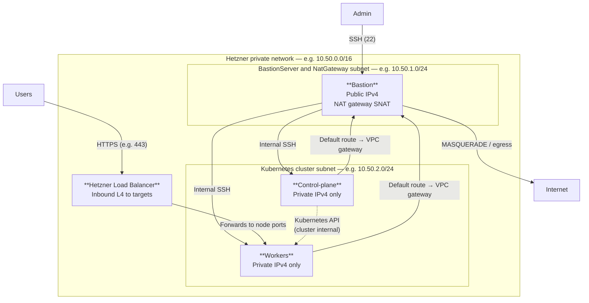

# Architecture

## Infrastructure layout

### Hetzner (Terraform `kubernetes` module)

- One **VPC** split into **two subnets**:
  - **Bastion subnet** — host with **public IPv4**, **SSH** entry point, **SNAT/NAT** for the cluster subnet.
  - **Cluster subnet** — **private-only** control-plane and workers; **default route** via the Hetzner network gateway; **Internet** traffic steered to the NAT host by cloud routes; **SSH to nodes** from the jump subnet (plus optional extra CIDRs).
- **Load balancers** — **inbound only** (not egress). By default a **workers** load balancer forwards **80→30080** and **443→30443** (typical ingress **NodePorts**). Exposing **kube-apiserver** on a public LB is **optional** (separate LB to control-plane **6443**).

Hetzner does not provide a managed NAT gateway; **MASQUERADE** on the bastion/NAT host provides egress for private nodes. Applications are typically reached via the **Hetzner load balancer** → workers.

### Topology diagram

### Traffic paths

| Path | Description |
|------|-------------|
| **Admin → cluster** | SSH from the Internet to the **jump** host; Ansible uses **ProxyJump** (or equivalent) to reach private **master/worker** IPs. |
| **Cluster → Internet** | Nodes use the VPC default gateway; **SDN route** `0.0.0.0/0` → jump private IP; jump performs **SNAT** for the cluster subnet (`apt`, image pulls, etc.). |
| **LB** | Inbound only. **Workers LB** default: **80→30080**, **443→30443**. Optional **API LB**: **6443** to control-plane. |
| **Firewalls** | Separate rules for **bastion** vs **Kubernetes** nodes (e.g. SSH to nodes restricted to jump subnet). |

### Original challenge layout (generic)

- Three Linux nodes per environment: **1** control-plane, **2** workers.
- Terraform defines nodes, network metadata, firewalls, and environment variables (`dev`, `prod`).

## Cluster architecture

- **Kubernetes**: **kubeadm** (Ansible `bootstrap-k8s.yml`).
- **CNI**: **Calico** (Tigera operator, applied by Ansible).
- **Ingress / TLS**: **Traefik** via GitOps (**`gitops/infrastructure/traefik/`**, Flux `HelmRelease`). **cert-manager** (operators) + **`ClusterIssuer/letsencrypt-prod`** (infrastructure) issue **Let’s Encrypt** certificates for **Ingress** resources (HTTP-01, **`ingressClassName: traefik`**).
- **Secrets**: **OpenBao** (operators) for KV; **External Secrets Operator** (operators) syncs **PushSecret** / **ExternalSecret** resources (e.g. demo app Postgres credentials). **Infrastructure** applies **`openbao-kubernetes-auth/`** to enable **`auth/kubernetes`** on OpenBao for ESO (see **`docs/gitops.md`**).
- **Monitoring**: **kube-prometheus-stack** (operators) — Prometheus, Alertmanager, **Grafana** (optional **Ingress** + HTTPS hostname in Helm values).
- **Stateful data**: **CloudNativePG** operator (operators) + **`Cluster`** CRs (shared DB under **`gitops/infrastructure/postgres/`**; app-scoped clusters under **`gitops/applications/`**).
- **Storage**: default **StorageClass** on the cloud (replaceable with CSI).

### Example public hostnames (dev GitOps)

DNS for these names should target the **workers load balancer** (Terraform output). **Port 80** must reach Traefik for ACME HTTP-01.

| Service | Hostname (as in repo) | Notes |
|--------|------------------------|--------|
| Demo API | `demo-app.alissonmachado.com.br` | Patched in **`applications/environments/dev/demo-app/`** |
| OpenBao UI/API | `openbao.alissonmachado.com.br` | **`infrastructure/openbao-ingress/`** — treat as privileged surface |
| Grafana | `grafana.alissonmachado.com.br` | **`kube-prometheus-stack`** `grafana.ingress` values |

## GitOps workflow

1. Changes are merged to Git (`main` or your trunk).
2. **Flux** syncs **`gitops/clusters/<env>/`** (`flux bootstrap github --path=./gitops/clusters/dev`, etc.).
3. Child **Flux `Kustomization`** resources apply **operators** (Helm), **applications** (kustomize), and **infrastructure** (Let’s Encrypt issuer, OpenBao Kubernetes-auth bootstrap Job, OpenBao ingress, Traefik, Postgres cluster, …), with **`dependsOn`** ordering on the dev cluster (see **`docs/gitops.md`**).
4. **Helm-controller** reconciles **`HelmRelease`** objects (operators and Traefik).
5. State is re-checked on each `spec.interval`.

See **[GitOps (Flux)](gitops.md)** for operators vs infrastructure vs applications.

## Environment separation

- **Terraform**: `terraform/environments/dev` and `terraform/environments/prod`.
- **GitOps**: one **`gitops/clusters/<env>/`** tree per cluster — do not mix `dev` and `prod` on the same cluster.
- **Ansible**: per-environment inventory files.

## Reproducibility

- Declarative Terraform and GitOps manifests.
- Idempotent Ansible roles.
- Version-pinned Helm charts and images where practical.
- Promotion **dev → prod** via pull request and review.
