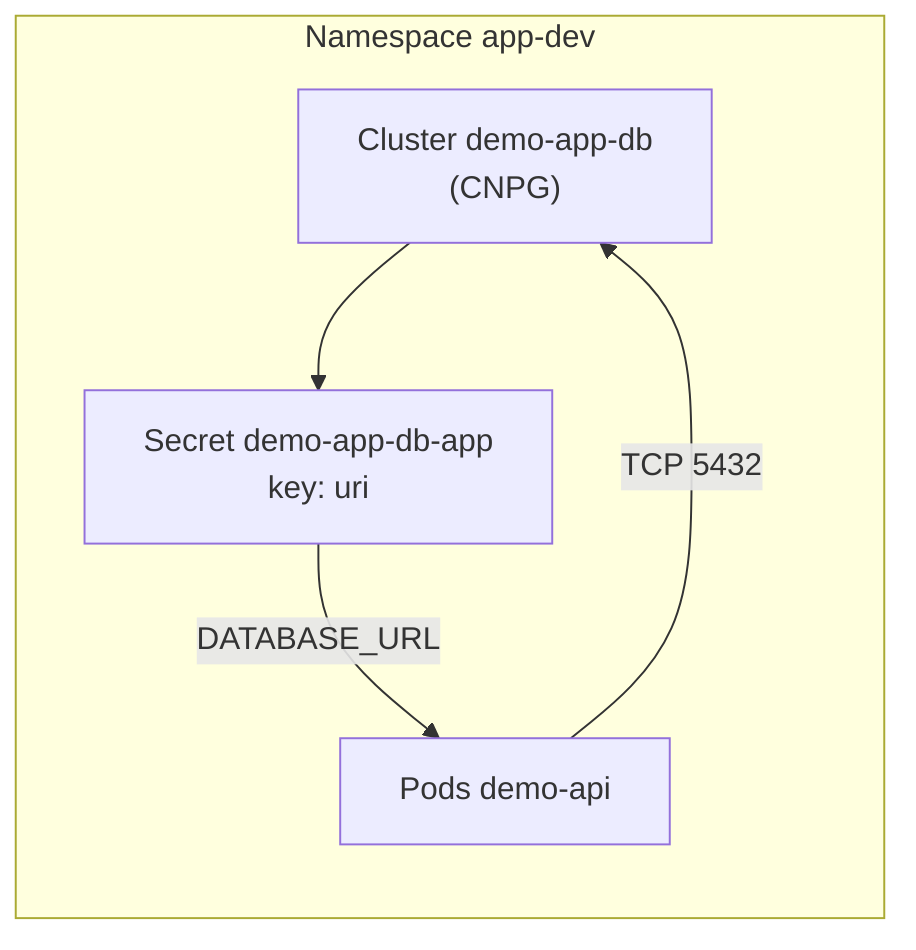

# Demo application (`demo-api`)

This document describes the **demo-api** sample application: what it does in the cluster, how it obtains PostgreSQL credentials, and how traffic reaches it.

## What it is

- **Source:** [`demo-app/`](../demo-app/) — **Go** service: entrypoint [`cmd/demo-api`](../demo-app/cmd/demo-api), packages under [`internal/`](../demo-app/internal/) (**`config`**, **`db`**, **`httpserver`** with embedded templates and OpenAPI), **pgx** for PostgreSQL.
- **Image:** Built and pushed by [`.github/workflows/demo-app-image.yml`](../.github/workflows/demo-app-image.yml) to **GHCR** (`ghcr.io/<github-owner-lowercase>/demo-app`, tags `latest`, `0.1.<run_number>`, and `sha-<short>`).
- **GitOps:** Base manifests live under [`gitops/applications/base/demo-app/`](../gitops/applications/base/demo-app/); the **dev** cluster uses an overlay at [`gitops/applications/environments/dev/demo-app/`](../gitops/applications/environments/dev/demo-app/) (Ingress host, Postgres replica count, optional Flux image automation).

The app exposes:

| Path | Purpose |
|------|---------|
| **`GET /`** | **HTML dashboard** — “demo only” banner, PostgreSQL connection status, list of **`public`** tables (from **`information_schema`**), and the **`items`** sample table with a small form to insert rows. |
| **`POST /demo/item`** | Form handler for the dashboard (adds a row to **`items`**, redirects to **`/`**). |
| **`GET /healthz`** | Liveness/readiness-style check (`{"status": "ok"}`). |
| **`GET /items`**, **`POST /items`** | JSON API — minimal CRUD over **`items`**. |
| **`GET /api/docs`** | Swagger UI (OpenAPI moved under **`/api`** so **`/`** is the UI). |
| **`GET /metrics`** | Prometheus metrics (**`prometheus/client_golang`**). |

On startup it runs **`CREATE TABLE IF NOT EXISTS items`** so an empty database becomes usable without manual migration.

**Backups:** **`demo-app-db`** is configured for **S3 / Hetzner Object Storage** (bucket **`dev-test-cnpg-backups`**, prefix **`demo-app-db/`**) with a **`ScheduledBackup`** every **5 minutes** (dev-oriented). Create **`Secret/cnpg-s3-credentials`** in **`app-dev`** — see **[CNPG backup secrets](cnpg-backup-secrets.md)** and **[`gitops/infrastructure/postgres/BACKUP.md`](../gitops/infrastructure/postgres/BACKUP.md)**.

## How it connects to PostgreSQL

### In-cluster (GitOps) flow

1. **CloudNativePG** [`Cluster`](../gitops/applications/base/demo-app/postgres-cluster.yaml) **`demo-app-db`** runs in namespace **`app-dev`**. Bootstrap creates database **`app`** owned by user **`app`**.
2. When the cluster is initialized, the CNPG operator creates a Kubernetes **`Secret`** named **`demo-app-db-app`**. This is the standard **application user** secret for that cluster (name pattern **`<clusterName>-<userName>`** → **`demo-app-db`** + owner **`app`** → **`demo-app-db-app`**).
3. That **`Secret`** includes a **`uri`** key: a full PostgreSQL connection URI (`postgresql://…` or equivalent) pointing at the primary (read-write) service (e.g. **`demo-app-db-rw.app-dev.svc.cluster.local`**).
4. The [**`Deployment/demo-api`**](../gitops/applications/base/demo-app/deployment.yaml) injects that URI into the container as **`DATABASE_URL`**:

   ```yaml
   env:
     - name: DATABASE_URL
       valueFrom:
         secretKeyRef:
           name: demo-app-db-app
           key: uri
   ```

5. **`demo-app`** prefers **`DATABASE_URL`** when set and passes it to **pgx**. If **`DATABASE_URL`** is unset (local runs), it falls back to **`DB_HOST`**, **`DB_PORT`**, **`DB_NAME`**, **`DB_USER`**, **`DB_PASSWORD`** (and optional **`DB_SSLMODE`**, default **`disable`**) to build a **`postgres://`** URI.



### Network path

- **DNS:** The URI’s host typically resolves to the CNPG **read-write** **`Service`** for the cluster (e.g. **`demo-app-db-rw`**).
- **Policy:** [`network-policy-demo-api-allow.yaml`](../gitops/applications/base/demo-app/network-policy-demo-api-allow.yaml) allows **`demo-api`** pods to egress to Postgres pods labeled by **`cnpg.io/cluster: demo-app-db`** on port **5432** (and DNS, ingress from Traefik/monitoring as defined there).

### Startup ordering

Until **`Secret/demo-app-db-app`** exists with a usable **`uri`**, pods that reference it may stay in **`CreateContainerConfigError`**. That is expected on a brand-new cluster until the **`Cluster`** is **ready** and CNPG has issued credentials. Once the secret is present, the deployment can start and the app connects on its **startup** hook.

## Dev overlay (Flux)

[`gitops/applications/environments/dev/demo-app/`](../gitops/applications/environments/dev/demo-app/) patches the base, for example:

- **Ingress** hostname and TLS (see **`ingress-dev-patch.yaml`**).
- **Postgres** instance count via **`postgres-instances-patch.yaml`** (HA-style replica count for dev).
- Optional **Flux image automation** ([`image-automation.yaml`](../gitops/applications/environments/dev/demo-app/image-automation.yaml)) to bump the deployment image tag from CI.

Image tags in the overlay may differ from **`latest`** in the base; follow the **`images:`** block in the dev **`kustomization.yaml`**.

## Local development (without the cluster secret)

Run from [`demo-app/`](../demo-app/) with Docker or **`go run ./cmd/demo-api`** **without** setting **`DATABASE_URL`**. The binary uses **`DB_*`** defaults above. **`LISTEN_ADDR`** defaults to **`:8080`**.

## Related documentation

- **[GitOps (Flux)](gitops.md)** — how applications are synced and how **`app-dev`** fits the tree.
- **[Operations](operations.md)** — backups, monitoring, and platform runbooks.
- **[Architecture](architecture.md)** — where the demo API sits in the network topology.
