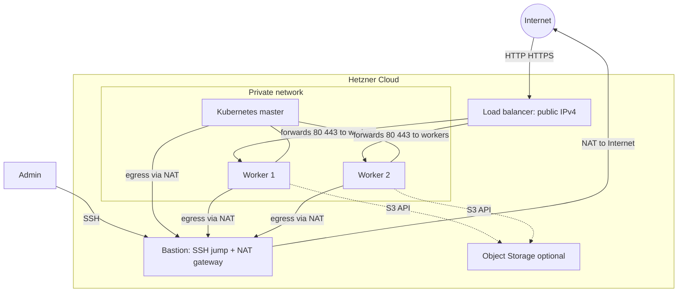

# Terraform

## Terraform layout in this repository


| Path                                                                               | Role                                                                                                                                                                             |
| ---------------------------------------------------------------------------------- | -------------------------------------------------------------------------------------------------------------------------------------------------------------------------------- |
| `**terraform/environments/<env>/**`                                                | Root modules per environment (e.g. **dev**): wires `**kubernetes`** + optional `**object_storage`**, exposes **outputs** (IPs, bucket name).                                     |
| `**terraform/modules/kubernetes/`**                                                | Full cluster footprint: **network**, **bastion/NAT**, **firewall**, **servers** (control plane + workers), **workers load balancer**, optional **Kubernetes API load balancer**. |
| `**terraform/modules/{network,nat-gateway,compute,loadbalancer,object-storage}/`** | Building blocks used by `**kubernetes`** or the env.                                                                                                                             |


The **dev** environment composes `**module "kubernetes"`** and, when `**object_storage_enabled`**, `**module "object_storage"**` for an S3-compatible bucket (CNPG backups). See **[postgres-backup-strategy](postgres-backup-strategy.md)**.

## Hetzner infrastructure (overview)

High-level picture of what exists in **Hetzner Cloud** after apply (not the Terraform module tree).




- **Bastion** — one server with a **public** IPv4: you **SSH** here as admin, then **ProxyJump** to private node IPs; the same host is the **NAT gateway** so the **master** and **workers** on the private network can reach the Internet (and object storage) outbound.
- **Load balancer** — public IPv4; forwards **80/443** to the **worker** nodes (Traefik NodePorts). DNS for apps points here — `**workers_load_balancer_ipv4`**.
- **Kubernetes cluster** — **one control-plane** and **two workers** on the private network (no public IPs on nodes by default). From the bastion you reach **master** and **workers** over the VPC only.
- **Object Storage** — optional **S3**-compatible bucket; workers reach it over the Internet path via **NAT**.

Set `worker_count` / `worker_private_ips` in `**terraform/environments/dev`** if you need a different worker count than the diagram (the sample may use one worker until scaled).

Optional **Kubernetes API load balancer**, **Traefik** NodePorts, and GitOps are configured **after** Terraform — see **[getting-started](getting-started.md)** and **[gitops](gitops.md)**.

## Dev environment (`terraform/environments/dev`)

Composite `**kubernetes`** module: 

- VPC
- bastion/NAT
- private control-plane + workers
- workers LB (**80→30080**, **443→30443**)
- optional API LB (**6443** behind the listener defined in module).

**Egress:** SDN route `0.0.0.0/0` → jump; nodes default via VPC gateway;.

```bash
export HCLOUD_TOKEN=...
cd terraform/environments/dev
terraform init 
terraform apply
```

**Outputs:** node IPs (`terraform output nodes`), `**workers_load_balancer_ipv4`** (public Ingress DNS — **80** must reach Traefik for ACME), `**object_storage_*`** when enabled.

**DNS:** public Ingress names → `**workers_load_balancer_ipv4`**.

**Object storage:** `object_storage_enabled = true` + keys → S3 bucket via **minio** provider; `**prevent_destroy`** on bucket. CNPG uses the bucket for `**dev-postgres/`**, `**major-upgrade-app/**`, and `**demo-app-db/**` prefixes (see **[postgres-backup-strategy](postgres-backup-strategy.md)**). Keys become `**cnpg-s3-credentials`** in Kubernetes (not applied by Terraform).

**Ansible:** jump public IP + private node IPs → `**ansible/inventory/dev-test-cluster.ini`**.

**NAT module (standalone docs):** **[terraform-nat-gateway.md](terraform-nat-gateway.md)**.

**State migration:** if upgrading module addressing for LBs, follow plan notes in Git history or `terraform state mv` only when plan indicates.